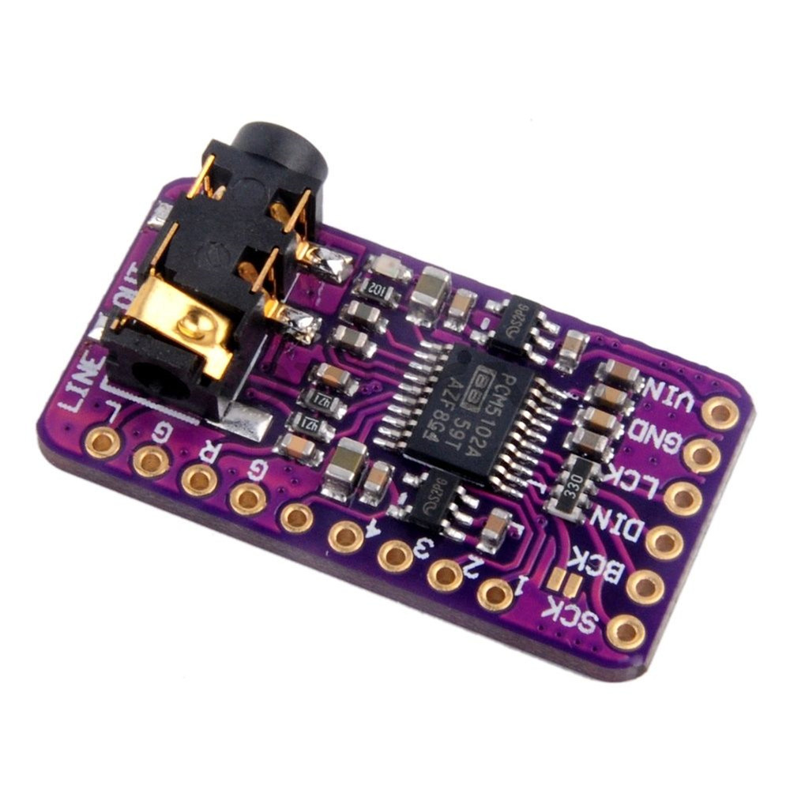

# BT Receiver

Bluetooth receiver is done using an ESP32 and a PCM5102A module DAC

## ESP32 Module

### ESP32 code

```c++
#include <BluetoothA2DPSink.h>
#include <Adafruit_NeoPixel.h>

#define NUM_LEDS 16
#define PIN_LEDS 5  // GPIO pin for NeoPixel data

BluetoothA2DPSink a2dp_sink;
Adafruit_NeoPixel leds(NUM_LEDS, PIN_LEDS, NEO_GRB + NEO_KHZ800);

float left_smoothed = 0;
float right_smoothed = 0;
const float alpha = 0.2;  // Smoothing factor (adjust for desired effect)

void audio_data_callback(const int16_t *data, int len) {
    int left_level = 0, right_level = 0;

    // Process stereo interleaved audio (L R L R)
    for (int i = 0; i < len; i += 2) {
        left_level += abs(data[i]);
        right_level += abs(data[i + 1]);
    }

    left_level /= (len / 2);
    right_level /= (len / 2);

    // Apply exponential moving average filter
    left_smoothed = alpha * left_level + (1 - alpha) * left_smoothed;
    right_smoothed = alpha * right_level + (1 - alpha) * right_smoothed;

    // Map smoothed values to LED count
    int left_leds = map(left_smoothed, 0, 30000, 0, NUM_LEDS / 2);
    int right_leds = map(right_smoothed, 0, 30000, 0, NUM_LEDS / 2);

    // Update LEDs with smooth transition
    for (int i = 0; i < NUM_LEDS; i++) {
        if (i < left_leds) leds.setPixelColor(i, leds.Color(0, 255, 0));  // Green for left
        else if (i >= NUM_LEDS / 2 && (i - NUM_LEDS / 2) < right_leds)
            leds.setPixelColor(i, leds.Color(0, 0, 255));  // Blue for right
        else leds.setPixelColor(i, 0);  // Turn off unused LEDs
    }

    leds.show();
}

void setup() {
    Serial.begin(115200);
    leds.begin();
    leds.show();  // Clear LEDs

    a2dp_sink.set_data_callback(audio_data_callback);
    a2dp_sink.start("ESP32-Audio");
}

void loop() {
    // Nothing needed here, everything runs via callbacks!
}
```

## DAC Module

This is an often seen module on Amazon, Bangood ... that is quite easy to use.



## Connections

DAC|ESP32
-|-
VIN|5V
GND|GND
SCK(System Clock)|GND
BCK(Bit Clock)|BCK(GPIO26)
LCK(Left-Right Clock)|WS(GPIO25)
DIN(Serial Data)|GPIO22

### Solder Bridges

- H1L: FLT - Filter select : Normal latency (Low) / Low latency (High)
- H2L: DEMP - De-emphasis control for 44.1kHz sampling rate: Off (Low) / On (High)
- H3L: XSMT - Soft mute control: Soft mute (Low) / soft un-mute (High)
- H4L: FMT - Audio format selection : I2S (Low) / Left justified (High)

Normally it's working w/o any soldering! However if you encounter any issues I suggest that you try with FLT:Low, DEMP: Low, XSMT: High, FMT: Low

### ESP32 Code For DAC

```c
static const i2s_config_t i2s_config = {
        .mode = (i2s_mode_t) (I2S_MODE_MASTER | I2S_MODE_TX),
        .sample_rate = 44100, // corrected by info from bluetooth
        .bits_per_sample = (i2s_bits_per_sample_t) 32, /* the A2DP 16 bits will be expanded to 32 bits */
        .channel_format = I2S_CHANNEL_FMT_RIGHT_LEFT,
        .communication_format = I2S_COMM_FORMAT_I2S_MSB,
        .intr_alloc_flags = 0, // default interrupt priority
        .dma_buf_count = 8,
        .dma_buf_len = 64,
        .use_apll = false,
        .tx_desc_auto_clear = true // avoiding noise in case of data unavailability
    };

    a2dp_sink.set_i2s_config(i2s_config);
```

## Bibligraphy

- [Github - External DAC](https://github.com/pschatzmann/ESP32-A2DP/wiki/External-DAC)
